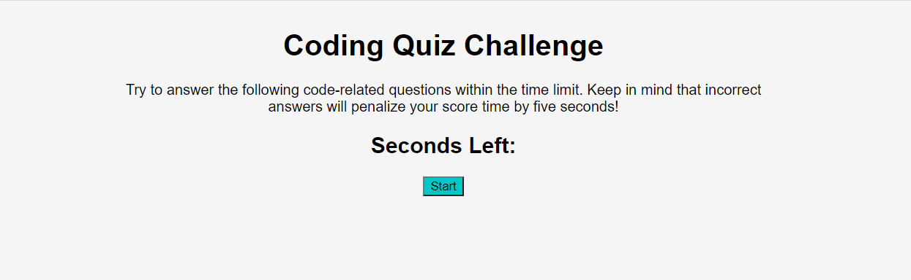

# Web APIs: Code Quiz

## Task

At some point in your journey to become a full-stack web developer, you’ll likely be asked to complete a coding assessment—perhaps as part of an interview process. A typical coding assessment includes both multiple-choice questions and interactive coding challenges.

To help familiarize you with these tests and allow you to use the skills covered in this unit, this week’s homework invites you to build a timed coding quiz with multiple-choice questions. This app will run in the browser and will feature dynamically updated HTML and CSS powered by JavaScript code that you write. It will have a clean, polished, and responsive user interface.

This week’s coursework will equip you with all the skills you need to succeed in this assignment.

## Goal

- When user clicks the 'start' button the timer starts and is presented with a question
- When the user answers the question they are presented with another question
- When a question is answered incorrectly time is deducted from the clock
- When all the questions are answered or the timer runs out (reaches 0) the game ends
- When the game ends the user can enter and save their initals and score

## Links

- Webpage:https://gbutler3.github.io/Web_APIs_Code_Quiz_Mini_Project/
- GitHub: https://github.com/gbutler3/Web_APIs_Code_Quiz_Mini_Project

## Screenshot Preview

- 
